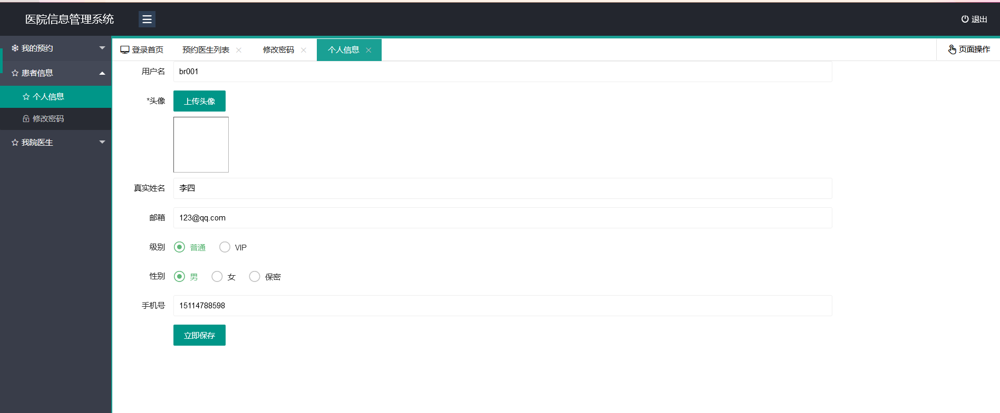

# lsepidemicsituationsystem

# 医院挂号信息管理系统

## 项目简介：

## 采用技术 ： 
- 前端：HTML + CSS + JavaScript + Bootstrap + Jquery + Ajax
- 后端：Spring  + Jsp + Maven + Schedule定时任务 + Redis + Security + POI

## 开发环境 ：
- 工具：IDEA、Navicat、Git
- 环境：JDK 1.8、Tomcat 7.0、Mysql 8.0
- 项目管理：Maven
- 代码托管平台：GitHub

## 开发流程：  
1、数据库设计  
2、Model：模型定义，与数据库相匹配  
3、Dao层：数据操作  
4、Service:服务包装  
5、Controller：业务入口，数据交互   
6、Util：工具类封装   
7、Config：配置类封装    
8、单元测试    

### 环境配置
##联系方式：Drake816@qq.com
#### 开发环境：Windows 10，IntelliJ IDEA 2021.3
#### 运行配置
1. 首先安装Mysql8.0，设置用户名为root，密码为123456，并保证其在运行状态，并执行library.sql文件导入数据。
2. 然后再配置Maven到环境变量中，在源代码目录下运行
## 功能模块 :  

### 概念设计

### 功能展示
#### 1.	首页登陆

#### 2.	管理员系统
用登陆进入
## 项目访问 :  
浏览器访问路径：http://localhost:8080/hospital_layui_war_exploded/